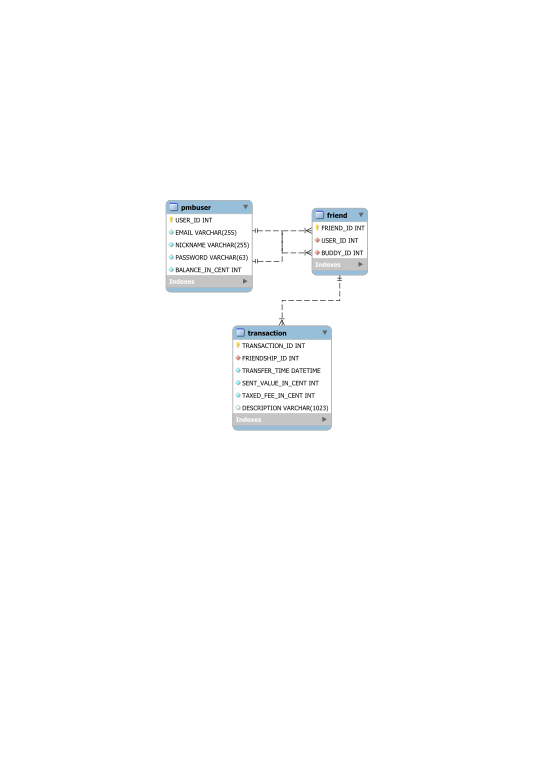

# PayMyBuddy

Auteur : Nicolas Garland

## Formation OpenclassRooms 'Développeur Java', Projet 6 : Concevez une application web Java de A à Z

'Pay My Buddy' est une application de transfert d'argent entre particulier.
Ce que nous avons ici est un premier prototype.

Avec 'Pay My Buddy', un utilisateur peut s'enregistrer, se connecter à l'application, indiquer qu'il est en relation avec d'autres utilisateurs, et leur transférer de l'argent.
Pour transférer de l'argent, l'utilisateur doit créditer son compte 'Pay My Buddy' (opérération bancaire non-supporté dans cette démo).
A partir de l'argent de son compte, il peut alors effectuer des transfer vers les comptes de ses amis.
Une taxe est prélevée pour financer l'application.
L'ami peut ensuite choisir de récupérer l'argent de son compte vers son compte bancaire (opération non supporté).

Cetta application a été codé en java avec Spring Boot.
Nous avons utilisé Thymeleaf pour la partie html.
Mes qonnées sont gérés par MySql.

Le fichier 'application.properties' (situé dans src/main/ressources) doit être complété avec les informations ad hoc selon la base de données du serveur (url, username et password de la 'datasource').
Le fichier 'DataBasePayMyBuddy.sql' contient les commandes sql pour générer les tables nécessaires à l'application.
Le nom de la 'database' peut être modifié si nécessaire, mais doit correspondre avec ce qui est mis dans 'application.properties' (en datasource.url).
Le fichier 'ExampleData.sql' contient des 'insert' pour avoir des données fictives à des fins de démonstrations de l'application.
Ces données concernent 4 personnes (Alice, Bob, Charlie et Delphine) dont les identifiants de connexions sont respectivement A@A, B@B, C@C et D@D pour les emails et AAA, BBB, CCC et DDD pour les mots de passe.

### Structure des données

L'application doit enregistrer des données sur les utilisateurs (table 'pmbuser').
Outre leur email et leur mot de passe, qui servent à se connecter, l'application doit sauvegarder le montant de leur compte.
L'application sauvegarde aussi un pseudonyme pour s'adresser aux utilisateurs d'une manière plus chaleureuse.

L'application doit également sauvegarder les relation entre les utilisateurs (table 'friend').
Les relations ne sont pas bilatérales (à moins d'être enregistrée deux fois, un fois dans un sens, une fois dans l'autre).

Enfin, l'application doit sauvegarder les transactions effectuées (table 'transaction').
Chaque transaction doit contenir le montant envoyé, ainsi que la taxe prélevée (le montant reàu peut être déduit de ses 2 informations).
Chaque transaction enregistre également l'expéditeur et le destinataire de la transaction en l'associant à une relation d'amitié.
On associe également à une transaction sa date (et heure) de transfert ainsi qu'une description optionnelle que peut renseigner l'expéditeur.

Le diagramme ci-dessous résume ses informations :

### Structure de l'application

Cette application a été codé en java, en utilisant Spring Boot.

La connection à l'application de la part d'un utilisateur est gérée par Spring Security, et est configuré dans le package '.security'.

Le package '.controller' contient les classes qui vont mapper les 'GET' et les 'POST' générés par l'utilisateur.
On a utilisé Thymeleaf pour interagir avec le html.
Quatre classes 'controller' ont été crées : PMBUserController, FriendController, TransactionController et BankController.
Ces classes reçoivent les requêtes de l'utilisateur et font appel aux classes du package '.service'.

Le package '.service' est également compossé de quatre classe selon la même logique.
Les classes ont des méthodes qui effectuent les calculs métiers.
Les interactions avec la base de données passe d'abord par les interfaces du package '.repository'.

Le package '.repository' contient trois fichiers (les opérations bancaires ne passent pas par notre base de données).
Ses fichiers codent sont tous trois des interfaces qui étendent 'CrudRepository'.
Les donnees récupérées depuis la base sont stocké en java dans des classe du package '.model'.

A chaque table de la base de données correspond une classe du package '.model'.
Ces classes définissent des 'entités' qui vont être manipuler par le programme java.

Enfin le package '.dto' contient quatre classes qui servent à stocker les données qui transitent depuis ou vers les pages html.

Ses information sont résumés sur le diagramme de classes ci-dessous :

