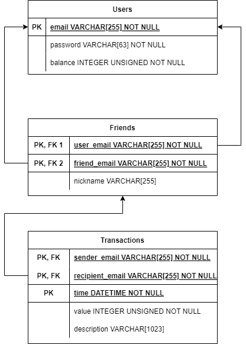

# PayMyBuddy

Auteur : Nicolas Garland

## Projet 6 de la formation Openclassrooms Développeur Java : Application de transfert d'argent

TODo list

màj sql !!

o index				html: ok
- o login			html: ok ; 	get: ok
- o newUser			html: ok ; 	get: ok ; 	post: ok
o home				html: ok ;	get: ok
- o credit			html: ok ;	get: ok ; 	post: ok
o transfer			html: ok ;	get: ok ; 	post (send money): ok
	o message de transfer mal/bien passé 0%
	o affichage des transactions : avec nickname au lieu de adresse : 0%
	o pagination des resultats : 0% 
	o commit et rollback ?? 0%
- o addFriend		html: ok ; 	get: ok ; 	post: ok
	o message de pas ok 0%
o profile			html: 95% ; get: 95%
- o modifUser		html: 95% ; get: 95% ; 	post: 95%
- o debit			html: 95% ; get: 95% ; 	post: 95%
- - o supprUser		95%
- o listOfFriend	html: 95% ; get: 95% ; 	post (remove): 95%
- o contact			html: 50% ; get: 60% ; 	post (send message): 0%

o securisation de l'acces à la base de donnée (mot de passe administrateur pas dans les properties)
o mise en page, CSS
o tests

bankService et repo
Transactions recu/envoyees : ne t'embête pas à les fusionner
redirect:/la-ou-on-veut-aller  -> get /la-ou-on-veut-aller
découpage des controller
pagination : bootstrap table
